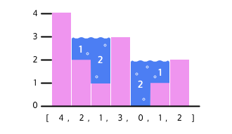

# The Problem 
 Imagine a very heavy rainstorm over a highway that has many potholes and cracks. The rainwater will 
 collect in the empty spaces in the road, creating puddles. Each puddle can only be as high as the surrounding road, 
 as any excess water will just flow away.
 
 The capturing rainwater problem asks you to calculate how much rainwater would be trapped in the empty spaces in a 
 histogram (a chart which consists of a series of bars)

 (This can be represented in Python as an array filled with the values [4, 2, 1, 3, 0, 1, 2]. Imagine that rainwater has fallen over the histogram and collected between the bars. Here’s how the previous histogram would look filled with water:)

Like with the road, the amount of water that can be captured at any given space cannot be higher than the bounds around it. To solve the problem, we need to write a function that will take in an array of integers and calculate the total water captured. Our function would return 6 for the histogram above. There are multiple ways to solve this problem, but we are going to focus on a naive implementation and an optimized implementation.

# The Concept
The foundation to all the solutions for this problem is that the amount of rainwater at any given index is the difference between the lower of highest bars to its left and right and the height of the index itself:

#### `water_at_index = min(highest_left_bound, highest_right_bound) - height_of_index`

Look at the histogram again. The amount of water at index 4 is 2. This is because its highest left bound is 4 (element at index 0), and its highest right bound is 2 (element at index 6). The lower of these two values is 2, and when we subtract the index’s height of 0, we get our answer of 2.

 # (The Naive Solution)
## The naive solution to the problem is to:

1. Traverse every element in the array
2. Find the highest left bound for that index
3. Find the highest right bound for that index
4. Take the lower of those two values
5. Subtract the height of that index from that minimum
6. Add the difference to the total amount of water

